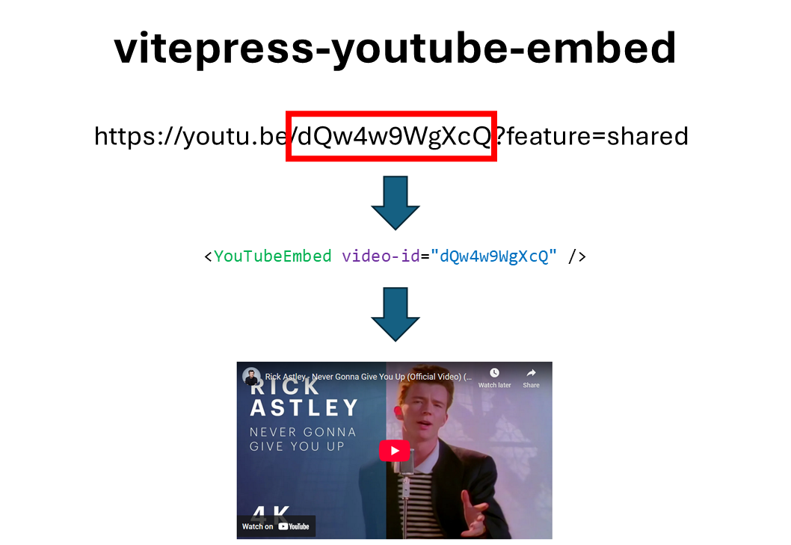
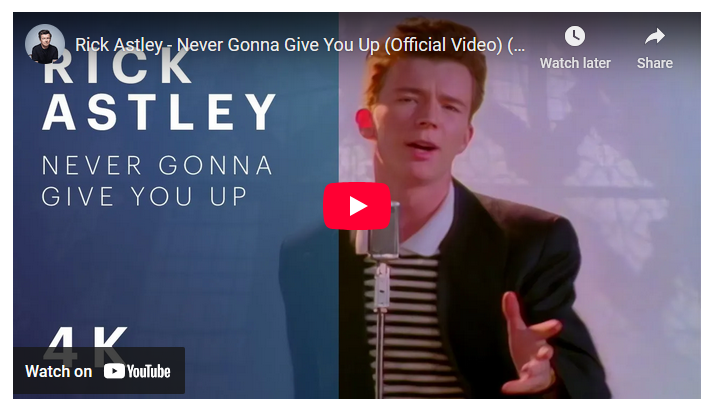

# vitepress-youtube-embed

Vue component to embed responsive YouTube videos in VitePress markdown pages using a simple syntax.

  

<p align="center">
  
</p>

## Live Demo and more information

✨ See it in action:  
👉 [https://miletorix.github.io/vitepress-youtube-embed/](https://miletorix.github.io/vitepress-youtube-embed/)

📦 NPM Package:  
👉 [https://www.npmjs.com/package/@miletorix/vitepress-youtube-embed](https://www.npmjs.com/package/@miletorix/vitepress-youtube-embed)

## Installation

```sh
npm i @miletorix/vitepress-youtube-embed
```

## Usage

### Configuration

```typescript
// docs/.vitepress/theme/index.ts
import type { Theme } from 'vitepress'
import DefaultTheme from 'vitepress/theme'
 
import { YouTubeEmbed } from '@miletorix/vitepress-youtube-embed' // [!code ++]
import '@miletorix/vitepress-youtube-embed/style.css' // [!code ++]

export default {
  extends: DefaultTheme,
  enhanceApp(ctx) {
    ctx.app.component('YouTubeEmbed', YouTubeEmbed) // [!code ++]
  }
}
```

### YouTube Embed

```vue
<YouTubeEmbed video-id="video-id..." />
```

## Example

**Source**: 

youtu.be/<span style="color: CornflowerBlue">**dQw4w9WgXcQ**</span>?feature=shared

**or** 

youtube.com/watch?v=<span style="color: CornflowerBlue">**dQw4w9WgXcQ**</span>&list=RDdQw4w9WgXcQ&start_radio=1

**Input**

```vue
<YouTubeEmbed video-id="dQw4w9WgXcQ" />
```

**Output**

 